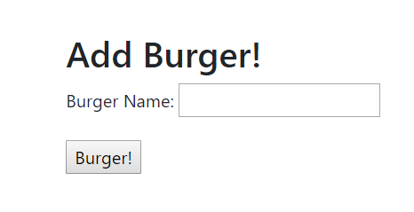
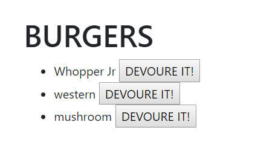
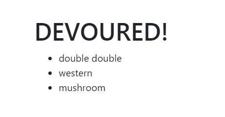

# Burger App!

Burger logger with MySQL, Node, Express, Handlebars and a homemade ORM

* This is a restaurant app that lets users input the names of burgers they'd like to eat.

* Whenever a user submits a burger's name, your app will display the burger on the left side of the page -- waiting to be devoured.

* Each burger in the waiting area also has a Devour it! button. When the user clicks it, the burger will move to the right side of the page.

* The app will store every burger in a database, whether devoured or not.

> This app is Created and Maintained by: Wendy Garcia.

Contact me!

> Phone: 904-207-9302

> Email: wendy.fern84@gmail.com